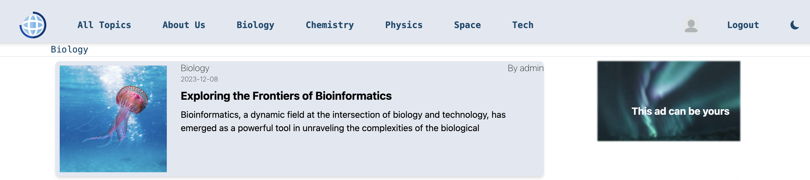
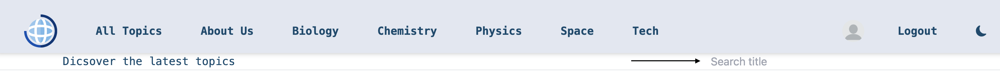
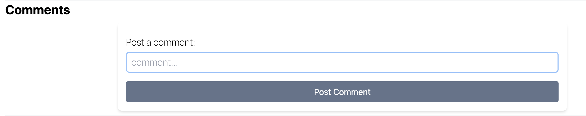

# News Project - REACT.JS Frontend


This is the frontend part of a final fullstack project that communicates with the [REST Spring Boot news-project server](https://github.com/robertmo98/newsProject/tree/main) thorugh http requests.

## Getting Started

### Prerequisites

Make sure you have Node.js and npm installed on your machine. You can download them from [Node.js official website](https://nodejs.org/).

### Installation

1. Clone the repository:

   ```bash
   git clone https://github.com/robertmo98/newsProjectFront.git
   cd newsProjectFront

2. Install dependencies: 
    npm install

### Starting up the application
1. run the designated server:
- [REST Spring Boot news-project server](https://github.com/robertmo98/newsProject/tree/main).
2. run this application:
- npm start

# Basic usage and features:
## Admin user:
- Regular users can be set as admin only directly in the server, by the programmer.
- Admin has the "Editor" button (star icon) newt to the profile picture, up in the navbar that allows to post an article (submitting the articles sends the form's data via http request to save the article on the database).

- To prevent confusions, logged users that are set as admin (on the server) are identified by the application and (in addition to the "Editor" button) will see the "Logged as editor" marked bar right under the navigation bar.

- Moreover, entering any article, admin has two additional buttons on the upper right front of the article- edit and delete.
the edit button allows the admin to edit any article (directrly updates the article on the db), and the edit allows to delete the article from the db.

## Regular registered user: 
- Any user is exposed to all of the articles. 
- Any user can post comments to all of the articles.

- Each user can edit his profile picture, by clicking the profile picture on the navigation bar (the initial picture is a generic profile) and logging a url of the image source. 

### Any user can be deleted manually in the profile settings (profile settings are shown by clicking the profile picture in the navigation bar)

## Website stracture:
- Upper navigation bar: displays the categories, (for admin - "Editor" button), profile picture (that leads to profile settings), 
logout button and dark mode toggle button.e
- for admin - Editor bar 
- The current category bar that shows the current category of articles to display.
- The search input that allows to filter the articles that match the search word (shown only on "All Topics" category!)
- A list of maximum 10 articles per page.
- Pagination bar to switch between pages.
- Footer, that contains link to the "Terms of use" page.
- The website is designed to store the user's JWT, allowing long-time connectivity without needing to login every time (currently, the server is designed to produce JWT that is valid for 7 days on each login request).

# Terms of use[Terms of use] 
### Can be found on http://localhost:3000/terms


## Available Scripts

In the project directory, you can run:

### `npm start`

Runs the app in the development mode.\
Open [http://localhost:3000](http://localhost:3000) to view it in the browser.

The page will reload if you make edits.\
You will also see any lint errors in the console.

### `npm test`

Launches the test runner in the interactive watch mode.\
See the section about [running tests](https://facebook.github.io/create-react-app/docs/running-tests) for more information.

### `npm run build`

Builds the app for production to the `build` folder.\
It correctly bundles React in production mode and optimizes the build for the best performance.

The build is minified and the filenames include the hashes.\
Your app is ready to be deployed!

See the section about [deployment](https://facebook.github.io/create-react-app/docs/deployment) for more information.

### `npm run eject`

**Note: this is a one-way operation. Once you `eject`, you can’t go back!**

If you aren’t satisfied with the build tool and configuration choices, you can `eject` at any time. This command will remove the single build dependency from your project.

Instead, it will copy all the configuration files and the transitive dependencies (webpack, Babel, ESLint, etc) right into your project so you have full control over them. All of the commands except `eject` will still work, but they will point to the copied scripts so you can tweak them. At this point you’re on your own.

You don’t have to ever use `eject`. The curated feature set is suitable for small and middle deployments, and you shouldn’t feel obligated to use this feature. However we understand that this tool wouldn’t be useful if you couldn’t customize it when you are ready for it.

## Learn More

You can learn more in the [Create React App documentation](https://facebook.github.io/create-react-app/docs/getting-started).

To learn React, check out the [React documentation](https://reactjs.org/).
